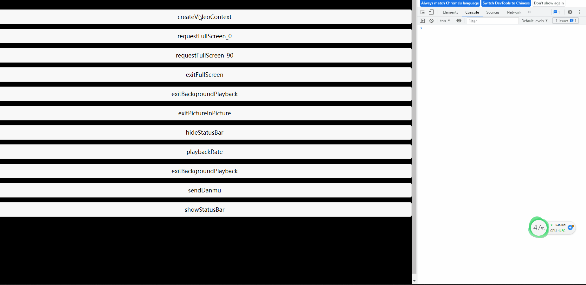
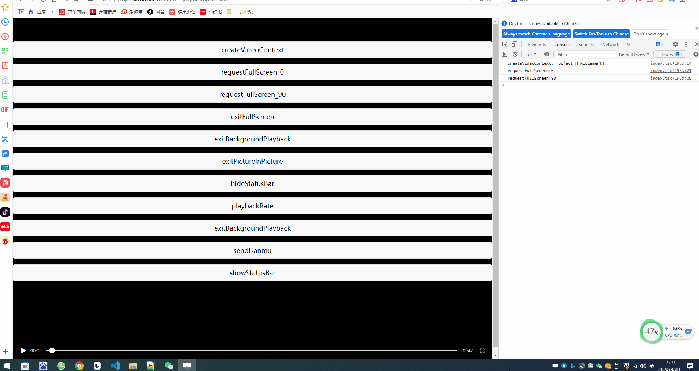

# videoContextDemo
### 简介
这是videoContext 的演示demo。h5存在问题：videoContext的exitBackgroundPlayback，exitPictureInPicture，hideStatusBar，playbackRate，requestBackgroundPlayback，sendDanmu，showStatusBar接口不支持

## demo 编译启动

在工程根目录下执行：
```
pnpm install
pnpm dev:h5
```

## 演示说明



